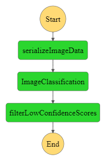

# Clinton Chikwata

## Project: Build a ML Workflow For Scones Unlimited On Amazon SageMaker
Image Classifiers are used in the field of computer vision to identify the content of an image and it is used across a broad variety of industries, from advanced technologies like autonomous vehicles and augmented reality, to eCommerce platforms, and even in diagnostic medicine.

You are hired as a Machine Learning Engineer for a scone-delivery-focused logistics company, Scones Unlimited, and you’re working to ship an Image Classification model. The image classification model can help the team in a variety of ways in their operating environment: detecting people and vehicles 
in video feeds from roadways, better support routing for their engagement on social media, detecting defects in their scones, and many more!

In this project, you'll be building an image classification model that can automatically detect which kind of vehicle delivery drivers have, in order to route them to the correct loading bay and orders. Assigning delivery professionals who have a bicycle to nearby orders and giving motorcyclists orders that are farther can help Scones Unlimited optimize their operations.


## 2. Getting Started

### 2.1. Project files:

**1. `starter.ipynb`:** This file contains all most of the workflow including preprocessing image dataset, model training , deployment, infering on the model 
**3. `Lambda.py` script:** `compilation of the necessary 'lambda.py' scripts used by three AWS Lambda functions to create a Step Functions workflow`.
**4. `Screenshot-of-Working-Step-Function.PNG`:** screen capture of working step function. <br><br>
**5. `stepfunction.json`:** Step Function exported to JSON<br><br>

### 2.2. Dependencies
```
Python 3 (Data Science) - v3.7.10 kernel
ml.t3.medium instance
Python 3.8 runtime for the AWS Lambda Functions
```

## 3. Approach:


1. The `serializeImageData` Lambda Function ([zipped `lambda_function.py` takes the address of an image hosted in S3, and returns a serialized JSON object.<br>
2. The `Image-Classification` Lambda Function ([zipped `lambda_function.py`  accepts the JSON object obtained from step 1 and sends it to an endpoint, collecting inferences as a JSON object.<br>
3. The `Filter Low Confidence Inferences` Lambda Function ([zipped `lambda_function.py`  takes the inference data from step 2, and filters only the images that meet the pre-defined threshold.<br>

### 3.2. Building a State Machine via AWS Step Functions




